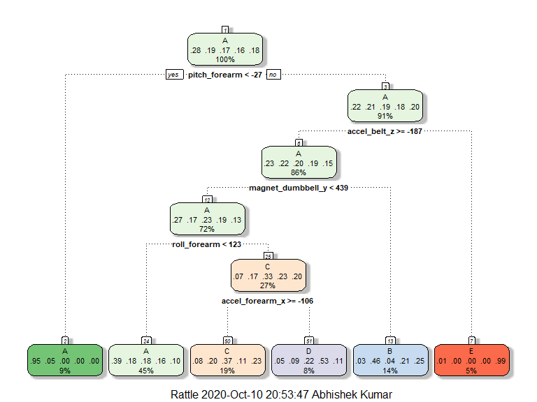

# 1. Background

Physical excercise is an important mean for maintaining good Health. Although
people regularly quantify how much of a particular activity they do, they rarely 
quantify how well they do it. This project will use data from accelerometers on 
the belt, forearm, arm, and dumbell of 6 participants. They were asked to perform 
barbell lifts correctly and incorrectly in 5 different ways. More information is 
available from the website here: http://groupware.les.inf.puc-rio.br/har (see the 
section on the Weight Lifting 
Exercise Dataset).


```r
library(caret)
library(rpart)
library(rattle)
library(gbm)
```


# 2. Data

This project uses the Weight Lifting Excercise data from this source:  
http://groupware.les.inf.puc-rio.br/har.  
Six young health participants were asked to perform one set of 10 repetitions of 
the Unilateral Dumbbell Biceps Curl in five different fashions: exactly according 
to the specification (Class A), throwing the elbows to the front (Class B), lifting 
the dumbbell only halfway (Class C), lowering the dumbbell only halfway (Class D) 
and throwing the hips to the front (Class E).

Class A corresponds to the specified execution of the exercise, while the 
other 4 classes correspond to common mistakes. Participants were supervised by 
an experienced weight lifter to make sure the execution complied to the manner 
they were supposed to simulate. The exercises were performed by six male participants 
aged between 20-28 years, with little weight lifting experience. We made sure 
that all participants could easily simulate the mistakes in a safe and controlled 
manner by using a relatively light dumbbell (1.25kg).  
Read more: http://groupware.les.inf.puc-rio.br/har#ixzz6aS6YT7Be

* The training data for this project are available here:  
https://d396qusza40orc.cloudfront.net/predmachlearn/pml-training.csv [11 MB]
* The test data are available here:  
https://d396qusza40orc.cloudfront.net/predmachlearn/pml-testing.csv [14 KB]

**Source:** Velloso, E.; Bulling, A.; Gellersen, H.; Ugulino, W.; Fuks, H. 
Qualitative Activity Recognition of Weight Lifting Exercises. Proceedings of 4th 
International Conference in Cooperation with SIGCHI (Augmented Human '13) . 
Stuttgart, Germany: ACM SIGCHI, 2013.  
Read more: http://groupware.les.inf.puc-rio.br/har#ixzz6aS4dDB00


```r
URL.training <- "https://d396qusza40orc.cloudfront.net/predmachlearn/pml-training.csv"
URL.testing <- "https://d396qusza40orc.cloudfront.net/predmachlearn/pml-testing.csv"

training <- read.csv(url(URL.training))
testing <- read.csv(url(URL.testing))
```


## 2.1 Processing

This data 19622 observations (rows) and 160 variables (columns). For building a
prediction model all the variables are not useful. Further, empty values or missing
values may cause problem im modelling. Therefore, the data need to be pre-processed.
Here, I have preprocessed as follows:
1. Removed variables with little variance
2. Removed variables which have high (greater than 95%) NA values 
3. Removed some variables which are not useful for modelling such as time stamp, 
id etc.
4. Finally, the outcome is transformed as factors


```r
# remove variables with little variance
NZV <- nearZeroVar(training)
training1 <- training[,-NZV]; testing1 <- testing[,-NZV] 

# remove variables with high NA values
obs.na <- sapply(training1, function(x) mean(is.na(x))) > 0.95
training1 <- training1[, obs.na == FALSE]; testing1 <- testing1[, obs.na == FALSE] 

# remove first seven variable which are not useful
training1 <- training1[, -c(1:7)]; testing1 <- testing1[, -c(1:7)] 

# setting outcome as factor
training1$classe <- as.factor(training1$classe)
```

## 2.2 Partitioning 

For modelling and testing, I have randomly divided the `training` data into two 
parts so that the `dat.train` has 75% whereas the `dat.test` has 25% of the total
observations. The output is stored as `dataframe`.


```r
set.seed(2548)
inTrain <- createDataPartition(training1$classe, p = 3/4, list = FALSE)
dat.train <- training1[inTrain,]
dat.test <- training1[-inTrain,]
```

# 3. Model Fitting

Several modelling algorithms are available for practical machine learning, however,
not all of them are accurate for a given dataset. Therefore, we must test different
models and select the one which is best performing. Here, I have used the following 
models:

* CART Model (`mod.rpart`)
* Random Forest Model (`mod.rf`)
* Linear Discrimant Analysis (`mod.lda`)
* Gradient Boosting Model (`mod.gbm`)
* Stacked Model via Random Forest (`mod.comb`)


```r
set.seed(4568)
mod.rpart <- train(classe ~ ., data = dat.train, method = "rpart")
fancyRpartPlot(mod.rpart$finalModel)
```

<!-- -->

```r
pred.rpart <- predict(mod.rpart, dat.test)
accu.rpart <- confusionMatrix(pred.rpart, dat.test$classe)$overall[1]

set.seed(5698)
mod.rf <- train(classe ~ ., data = dat.train, method = "rf", ntree = 100)
pred.rf <- predict(mod.rf, dat.test)
accu.rf <- confusionMatrix(dat.test$classe, pred.rf)$overall[1]
```

All these models are cross-validated using the `accuracy` as selection measure.


```r
set.seed(4568)  
mod.lda <- train(classe ~ ., data = dat.train, method = "lda")
pred.lda <- predict(mod.lda, dat.test)
accu.lda <- confusionMatrix(dat.test$classe, pred.lda)$overall[1]

mod.gbm <- train(classe ~ ., data = dat.train, method = "gbm", verbose = FALSE)
pred.gbm <- predict(mod.gbm, dat.test)
accu.gbm <- confusionMatrix(dat.test$classe, pred.gbm)$overall[1]
 
predDF <- data.frame(pred.rpart, pred.rf, pred.lda, pred.gbm, 
                     classe = dat.test$classe)
mod.comb <- train(classe ~ ., data = predDF, method = "rf", ntree = 100)
pred.comb <- predict(mod.comb, predDF)
accu.comb <- confusionMatrix(dat.test$classe, pred.comb)$overall[1]

data.frame(RF = round(accu.rf, 4), GBM = round(accu.gbm, 4), 
           LDA = round(accu.lda, 4), RPART = round(accu.rpart, 4),
           STACK = round(accu.comb, 4))
```

```
##              RF    GBM    LDA RPART  STACK
## Accuracy 0.9955 0.9666 0.6949 0.481 0.9961
```

Among these models, the random forest model clearly outperformed all other models.
Further, the stacked model resulted in little increase in accuracy. 
We can test these models for out of sample by evaluating their accuracy on a new 
dataset.


```r
pred1 <- predict(mod.rf, dat.train)
pred2 <- predict(mod.gbm, dat.train)
pred3 <- predict(mod.lda, dat.train)
pred4 <- predict(mod.rpart, dat.train)

accu1 <- confusionMatrix(dat.train$classe, pred1)$overall[1]
accu2 <- confusionMatrix(dat.train$classe, pred2)$overall[1]
accu3 <- confusionMatrix(dat.train$classe, pred3)$overall[1]
accu4 <- confusionMatrix(dat.train$classe, pred4)$overall[1]

data.frame(RF = round(accu1 - accu.rf, 4), GBM = round(accu2 - accu.gbm, 4), 
           LDA = round(accu3 - accu.lda, 4), RPART = round(accu4 - accu.rpart, 4))
```

```
##              RF    GBM     LDA  RPART
## Accuracy 0.0045 0.0067 -0.0054 0.0097
```

The outof sample error was higher for CART model and lower for Random Forest model.
Interesting, the linear discriminant analysis model had higher accuracy on new data.

# 4. Prediction

Above results suggest that random forest model is best model and we can use it for 
further prediction.


```r
predict(mod.rf, testing)
```

```
##  [1] B A B A A E D B A A B C B A E E A B B B
## Levels: A B C D E
```

# 5. Conclusion

The Random Forest Model was very accurate model for prediction. Further, the 
stacked model or ensemble model showed higher accuracy. Thus suggest that results
for combined models are usually very accurate.
